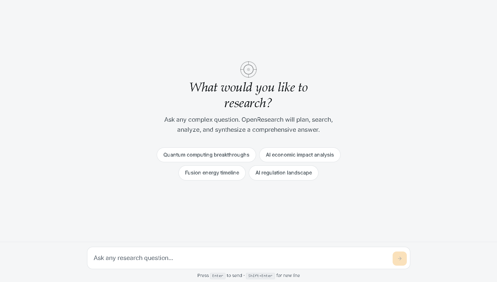

<p align="center">
  
</p>

# OpenResearch

OpenResearch is a research-focused orchestration framework for large-scale, iterative information discovery and synthesis. It combines planning, targeted search, robust scraping, semantic indexing, and iterative reasoning to produce thorough, well-cited research outputs.

This repository includes a reference implementation, helper tools, and a minimal web UI for visualization and interaction.

## Badges

<p align="center">
  <a href="https://langgraph.readthedocs.io/"></a>
  <a href="https://opensource.org/licenses/MIT"></a>
</p>

## Quick Summary

- Iterative, agentic research pipeline: plan → search → extract → embed → reason → detect gaps → iterate.
- Designed for extensibility: swap nodes (search, embeddings, storage) with minimal changes.
- Includes a lightweight FastAPI server and a simple web frontend.

## Why This Project Exists

Many retrieval systems perform a single-pass fetch-and-summarize. OpenResearch aims to replicate a researcher's workflow: detect gaps, craft follow-up queries, re-retrieve, and synthesize robust answers with provenance.

## Contents

- Features
- Architecture
- Repository Layout
- Quickstart
- Development & Tests
- Extending the System
- Contributing & License

## Features

- Planner node to break complex queries into sub-questions.
- Query generation for broad, optimized search coverage.
- Web scraping and content extraction utilities.
- Chunking + embedding pipeline for semantic storage.
- ChromaDB-backed vector store with example snapshots under `chroma_db/`.
- Configurable embeddings adapter with an Ollama wrapper included.
- Multi-stage ranking and an LLM-driven reasoning/synthesis node.
- Minimal web UI and API for live runs and results inspection.

## Architecture

The implementation is modular: each pipeline stage is a node in a directed graph (LangGraph-style). Each node is responsible for a single concern and is composed via the orchestration layer.

### High-Level Stages

1. Planning — Decompose the top-level task.
2. Query Generation — Produce targeted search queries.
3. Retrieval & Scraping — Collect and clean content from web sources.
4. Chunking & Embedding — Split and embed content for the vector store.
5. Ranking & Retrieval — Retrieve the best evidence for reasoning.
6. Reasoning & Synthesis — Multi-step synthesis with gap detection.

See [CLAUDE.md](CLAUDE.md) for a detailed architecture note and operational commands used by the original developer.

## Repository Layout

- `Agent/` — example agent entrypoint and demo scripts.
- `src/agent/core/` — graph and orchestration core.
- `src/agent/nodes/` — planner, query_gen, search, processing, storage, synthesis, reasoning, etc.
- `src/api/` — API and CLI wrappers (FastAPI endpoints and CLI).
- `chroma_db/` — sample ChromaDB files included as examples.
- `assets/` — logo and branding assets.
- `web/` — lightweight frontend.
- `tests/` and `test_system.py` — test harnesses.

## Quickstart

### Prerequisites

- Python 3.10+ (3.11/3.13 tested by contributors).
- Optional: Ollama for embeddings or another embeddings provider.

### Local Setup

1. Create and activate a virtual environment:

```powershell
python -m venv .venv
.\.venv\Scripts\Activate.ps1
```

2. Install dependencies. This repo includes a helper called `uv` used by the original author. If you have it available, run:

```powershell
uv sync
```

If you don't use `uv`, install dependencies via your preferred method (`pip`, `pipx`, or `poetry`). If a `requirements.txt` is not present, generate one from your environment or ask me to create one.

## Configuration

Create a `.env` file in the project root to store API keys and runtime settings.

```env
TAVILY_API_KEY=your_tavily_key
GEMINI_API_KEY=your_primary_key
GEMINI_API_KEY_1=key_2
OLLAMA_HOST=localhost:11434
```

## Running the Server

Start the FastAPI server:

```powershell
uv run python server.py
# or
uv run python -m src.api.server
```

Run the agent/demo from the command line:

```powershell
uv run python -m Agent.agent
```

## Development

- Core code lives in `src/agent/`; add or update nodes in `src/agent/nodes/`.
- To change embedding providers, edit `src/database/embeddings.py`.
- To modify persistence, edit `src/database/vector_db.py`.

## Testing

Run the test harness:

```powershell
uv run python test_system.py
```

## Extending the System

- Add retrieval backends by implementing a node with the repo's node interface and register it in the orchestration graph.
- Add custom rankers or rerank stages between retrieval and reasoning.
- Implement new exporters in `src/agent/tools/` for custom outputs.

## Troubleshooting & Tips

- If embedding pull fails, verify your Ollama daemon and network.
- If the server fails to start, check that required environment variables exist and that ports (default 8000) are free.
- Use the sample ChromaDB under `chroma_db/` for development—don't overwrite production snapshots.

## Contributing

Contributions are welcome.

1. Fork the repo and create a feature branch.
2. Add tests for new functionality.
3. Open a PR describing motivation and changes.

## License

This snapshot references the MIT license in badges; please add a `LICENSE` file if you intend to publish this repo publicly.

## Acknowledgements & References

- See [CLAUDE.md](CLAUDE.md) for original architecture notes and operational commands used by the project's author.

## Next Steps I Can Do for You

- Export `assets/logo.svg` to transparent PNG and multiple sizes.
- Generate a `requirements.txt` or `pyproject.toml` refinement.
- Add a compact CONTRIBUTING guide and automated lint/test targets.

## Web UI (Next.js)



A minimal black-and-white Next.js web UI is included in `webui/`.

To run the frontend locally:

```bash
cd webui
npm install
npm run dev
```

The frontend currently uses a placeholder API at `webui/pages/api/research.js`. Update that file to forward requests to your FastAPI backend, for example `http://localhost:8000/your-endpoint`, to enable live research runs.
